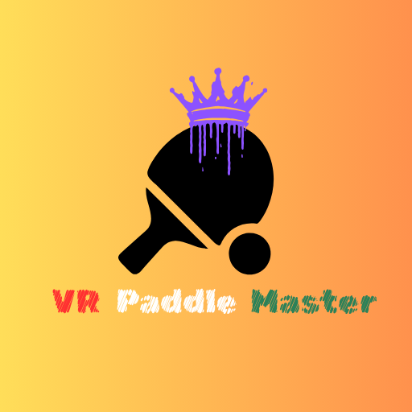

# VR Paddle Master

<h3>Get ready to bounce like a true master!</h3>

VR Paddle Master is an arcade VR experience where your only mission is… keep the ball from falling!

Use your paddle to juggle a ball as long as possible in a clean and dynamic virtual arena. Earn points, beat your highscore, and face unexpected gameplay modifiers like:

<ul>
 <li>🍃Wind that changes direction</li>
 <li>🌍 Variable gravity</li>
 <li>🔻 Ball resizing</li>
 </ul>

Every round is a new challenge, and only the most skilled players will master the controlled chaos!

<h3>🎨Customize</h3>

Customize your experience: change the environment, platform, ball effect, trail, hit particles, and much more. Unlock items by playing and earning points, or optionally purchase them to expand your style.

<h3>🔁 Great for:</h3>
<ul>
 <li>Players who want to challenge themselves</li>
 <li>Casual gamers looking for a quick, fun experience</li>
 <li>Kids and families looking for something intuitive and engaging</li>
</ul>

If you’re looking for a simple, satisfying, and challenging VR game... VR Paddle Master is your perfect pick.

<ul>
 <li>No data collection</li>
 <li>Offline gameplay</li>
 <li>One-time purchase</li>
</ul>

<a href="https://www.meta.com/it-it/experiences/vr-paddle-master/9730277910384893/" target="_blank" style="
    display: inline-block;
    background-color: #00ff00;
    color: black;
    padding: 12px 24px;
    font-weight: bold;
    border-radius: 4px;
    text-decoration: none;
    font-family: monospace;
 ">
    ▶️ Play on Meta Quest Store
 </a>

📜 [Privacy Policy](Privacy Policy.txt)  
📧 Contact: ravensrosedev@gmail.com
